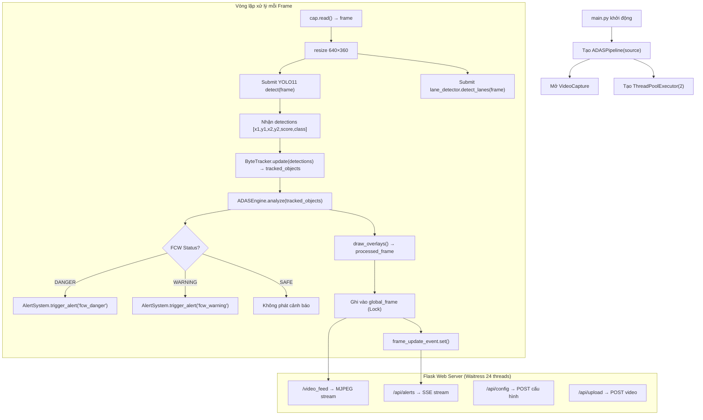

# 📘 COURSEWORK — ĐỌC HIỂU DỰ ÁN TRAFFICVISION ADAS

**Môn học:** Xử lý ảnh và Thị giác Máy tính  
**Nhóm:** 8 — Trường ĐH Giao thông Vận tải TP.HCM  
**Ngày viết:** 11/07/2026

---

## MỤC LỤC

1. [Tổng quan Dự án](#1-tổng-quan-dự-án)
2. [Cây thư mục & Vai trò từng File](#2-cây-thư-mục--vai-trò-từng-file)
3. [Luồng hoạt động chính (Pipeline)](#3-luồng-hoạt-động-chính-pipeline)
4. [Chi tiết từng Module](#4-chi-tiết-từng-module)
5. [Giao diện Web Dashboard](#5-giao-diện-web-dashboard)
6. [REST API & Giao thức SSE](#6-rest-api--giao-thức-sse)
7. [Cấu hình hệ thống (`config.yaml`)](#7-cấu-hình-hệ-thống-configyaml)
8. [Kiểm thử tự động (Unit Test)](#8-kiểm-thử-tự-động-unit-test)
9. [Các thuật toán cốt lõi](#9-các-thuật-toán-cốt-lõi)
10. [Phân công công việc Nhóm](#10-phân-công-công-việc-nhóm)

---

## 1. Tổng quan Dự án

**TrafficVision ADAS** là hệ thống **Hỗ trợ Lái xe Nâng cao (Advanced Driver Assistance System)** chạy thời gian thực trên GPU NVIDIA CUDA. Hệ thống nhận đầu vào từ camera hành trình (dashcam) hoặc file video, phân tích bằng AI và đưa ra cảnh báo va chạm bằng giọng nói tiếng Việt.

### Công nghệ sử dụng

| Thành phần | Công nghệ | Phiên bản |
|---|---|---|
| Ngôn ngữ | Python | 3.10+ |
| Phát hiện vật thể | YOLO11n (Ultralytics) | 2024 |
| Bám vết đa mục tiêu | ByteTrack (Hungarian + IoU) | Custom |
| GPU Acceleration | PyTorch CUDA | 2.5 / CUDA 12.1 |
| Xử lý ảnh | OpenCV | 4.11 |
| Web Backend | Flask + Waitress WSGI | 3.1.3 |
| Giao thức realtime | SSE (Server-Sent Events) | — |
| Âm thanh TTS | gTTS + Pygame Mixer | — |

### Chức năng chính

1. **Nhận diện 7 lớp vật thể:** Ô tô, Xe máy, Xe buýt, Xe tải, Người đi bộ, Biển báo, Đèn giao thông.
2. **Bám vết (Tracking):** Gán ID liên tục cho từng phương tiện qua nhiều khung hình, kể cả khi bị che khuất tạm thời.
3. **Ước lượng khoảng cách:** Công thức hình học Pinhole Camera kết hợp góc nghiêng đường chân trời.
4. **Cảnh báo va chạm (FCW):** Tính TTC (Time-To-Collision) và khoảng cách, phát cảnh báo bằng giọng nói tiếng Việt.
5. **Web Dashboard:** Giao diện Glassmorphism theo phong cách Tesla Autopilot, stream video MJPEG và cảnh báo SSE.

---

## 2. Cây thư mục & Vai trò từng File

```text
ADAS/
├── main.py                  # ① Entry point — Khởi động hệ thống
├── requirements.txt         # Danh sách thư viện pip
├── config/
│   └── config.yaml          # ② File cấu hình YAML (ngưỡng, cổng, đường dẫn model)
├── models/
│   └── best.pt              # Trọng số YOLO11 đã huấn luyện
├── src/                     # ====== MÃ NGUỒN CHÍNH ======
│   ├── app.py               # ③ Flask server + ADASPipeline (vòng lặp xử lý chính)
│   ├── detector.py          # ④ YOLO11 Wrapper — phát hiện vật thể
│   ├── tracker.py           # ⑤ ByteTrack — bám vết đa mục tiêu
│   ├── adas_engine.py       # ⑥ Bộ não ADAS — khoảng cách, TTC, FCW
│   ├── alert_system.py      # ⑦ Phát âm thanh cảnh báo tiếng Việt
│   ├── config_loader.py     # ⑧ Singleton đọc config.yaml
│   └── lane_detector.py     # Stub (tạm vô hiệu hóa)
├── templates/
│   └── index.html           # ⑨ Giao diện HTML5 Dashboard
├── static/
│   ├── css/style.css        # ⑩ CSS Glassmorphism dark theme
│   ├── js/main.js           # ⑪ JavaScript SSE listener + Web Audio
│   ├── audio/               # File .mp3 tiếng Việt (gTTS tự sinh)
│   └── uploads/             # Video do người dùng tải lên
├── tests/
│   ├── test_engine.py       # Unit test cho ADASEngine
│   └── test_adas.py         # Unit test cho Distance + Corridor
├── logs/
│   └── system.log           # Log hệ thống (Dual-Logger)
└── docs/
    ├── MASTER_REPORT.md     # Báo cáo đồ án tốt nghiệp
    └── COURSEWORK.md        # ← File này
```

---

## 3. Luồng hoạt động chính (Pipeline)



### Giải thích luồng

| Bước | File | Hàm | Mô tả |
|------|------|-----|-------|
| 1 | `main.py` | `__main__` | Parse CLI args, tạo Logger, gọi `start_pipeline_thread()` trong Daemon Thread |
| 2 | `app.py` | `ADASPipeline.__init__` | Khởi tạo Detector, Tracker, Engine, AlertSystem, mở VideoCapture |
| 3 | `app.py` | `ADASPipeline.run` | Vòng lặp chính: đọc frame → YOLO → Track → ADAS → Vẽ → Ghi shared memory |
| 4 | `app.py` | `gen_frames()` | Generator yield ảnh JPEG cho MJPEG stream |
| 5 | `app.py` | `api_alerts()` | Generator yield JSON qua SSE mỗi khi có `frame_update_event` |

---

## 4. Chi tiết từng Module

### 4.1 `detector.py` — YOLODetector

**Nhiệm vụ:** Bọc (wrap) mô hình YOLO11n từ thư viện Ultralytics.

```python
class YOLODetector:
    def detect(self, frame) -> List[x1, y1, x2, y2, score, class_id]:
```

**Tối ưu hóa quan trọng:**
- Bật **FP16 Half-Precision** trên GPU CUDA → tăng tốc ~2x nhờ TensorCore.
- Truyền `classes=[0..6]` trực tiếp vào Ultralytics để lọc class ở tầng C++ thay vì Python.
- Chuyển toàn bộ tensor (xyxy, conf, cls) sang CPU **một lần duy nhất** bằng `.cpu().numpy()` — tránh CUDA sync bottleneck.
- **Heuristic sửa lỗi nhận sai:** Nếu mô hình nhận Ô tô nhưng aspect ratio hộp < 0.55 → tự động chuyển thành Xe máy.

### 4.2 `tracker.py` — ByteTracker

**Nhiệm vụ:** Gán ID liên tục cho từng phương tiện qua nhiều khung hình.

**Thuật toán cốt lõi:**
1. **Predict:** Mỗi Track tăng `time_since_update`.
2. **Association:** Tính ma trận chi phí IoU giữa tất cả tracks × detections.
3. **Hungarian Algorithm:** Giải bài toán gán việc tối ưu (`scipy.linear_sum_assignment`).
4. **Match/Unmatch:** Cặp (track, det) có IoU > ngưỡng → cập nhật. Detection mới → tạo Track. Track cũ quá `max_age` → xóa.
5. **Smoothing:** Bbox được làm mịn bằng EMA (`α = 0.7`) giữa vị trí cũ và mới.

```
Cost(track_i, det_j) = 1 - IoU(track_i.bbox, det_j.bbox)
```

### 4.3 `adas_engine.py` — ADASEngine

**Nhiệm vụ:** Bộ não trung tâm — tính khoảng cách, TTC, xác định xe nguy hiểm nhất.

#### Ước lượng khoảng cách (`estimate_distance`)

Kết hợp 2 phương pháp:
- **Phương pháp 1 — Chiều cao hộp:** `d = (real_h × focal) / h_box`
- **Phương pháp 2 — Góc nghiêng:** `d = (cam_h × f) / (y2 - y_horizon)`
- **Kết hợp:** `dist = 0.6 × d_height + 0.4 × d_horizon`
- **Khoảng cách 3D:** `dist_3d = √(dist_long² + dist_lat²)`

#### Hành lang thích ứng (`is_in_lane`)

| Loại xe | `corridor_ratio` | Lý do |
|---------|-------------------|-------|
| Ô tô, Xe buýt, Xe tải | 0.38 | Chiếm diện tích mặt đường lớn |
| Xe máy | 0.26 | Thường chạy sát sườn ô tô ở VN → giảm báo giả |

#### Tính TTC (Time-To-Collision)

```
v_rel = (d_prev - d_current) / Δt          # Vận tốc tương đối thô
v_smooth = 0.25 × v_raw + 0.75 × v_prev    # Làm mịn EMA
TTC = d_current / v_smooth                   # Chỉ khi v > 0.1 m/s
```

#### Logic cảnh báo FCW

```
DANGER  ← dist < 8m  HOẶC  (dist < 27m AND TTC < 1.3s AND v_rel > 0.8)
WARNING ← dist < 18m HOẶC  (dist < 27m AND TTC < 2.3s AND v_rel > 0.8)
SAFE    ← Còn lại
```

### 4.4 `alert_system.py` — AlertSystem

**Nhiệm vụ:** Phát cảnh báo bằng giọng nói tiếng Việt.

**Kiến trúc:**
- Sử dụng **gTTS** tự sinh file `.mp3` tiếng Việt lần chạy đầu tiên.
- Phát qua **Pygame Mixer** trên 1 **Worker Thread** duy nhất + `queue.Queue`.
- **Preemption:** Cảnh báo `fcw_danger` sẽ xóa hàng đợi và ngắt âm thanh đang phát để phát ngay.
- **Cooldown:** 12 giây cho mỗi loại cảnh báo, 6 giây cooldown toàn cục.

| Loại cảnh báo | File MP3 | Nội dung |
|---|---|---|
| `fcw_danger` | `khoang_cach_nguy_hiem.mp3` | "Cảnh báo! Khoảng cách nguy hiểm..." |
| `fcw_warning` | `chu_y_giu_khoang_cach.mp3` | "Chú ý giữ khoảng cách an toàn." |
| `ldw_left` | `lech_lan_trai.mp3` | "Cảnh báo! Lệch làn bên trái." |
| `ldw_right` | `lech_lan_phai.mp3` | "Cảnh báo! Lệch làn bên phải." |
| `startup` | `he_thong_khoi_dong.mp3` | "Hệ thống ADAS đã khởi động..." |

### 4.5 `config_loader.py` — Config (Singleton)

**Nhiệm vụ:** Đọc file `config/config.yaml` một lần duy nhất, cung cấp API truy vấn cho toàn bộ module.

```python
config_inst = Config()                         # Singleton toàn cục
val = config_inst.get("model.conf_threshold", 0.25)  # Truy vấn bằng dấu chấm
```

### 4.6 `main.py` — Entry Point

**Nhiệm vụ:** Điểm khởi chạy chương trình.

**Các bước khởi động:**
1. Cấu hình UTF-8 cho Windows console.
2. Tạo **Dual-Logger** ghi đồng thời ra console + `logs/system.log`.
3. Parse CLI arguments (`--source`, `--host`, `--port`).
4. Kiểm tra file `models/best.pt`, tự tải fallback nếu thiếu.
5. Tạo **Daemon Thread** chạy `ADASPipeline`.
6. Khởi chạy **Waitress WSGI** (24 threads) phục vụ Flask app.

---

## 5. Giao diện Web Dashboard

### Bố cục 2 cột (Autopilot HUD)

| Cột trái (Chính) | Cột phải (Sidebar) |
|---|---|
| Luồng video MJPEG (`/video_feed`) | Thông số FPS, TTC, Distance |
| Badge "HỆ THỐNG TỰ LÁI ĐANG BẬT" | Trạng thái FCW (SAFE / WARNING / DANGER) |
| Nhấp nháy viền đỏ/vàng khi nguy hiểm | Bộ đếm vật thể theo từng lớp |
| | Thanh trượt cấu hình ngưỡng |
| | Nút tải video / chọn Demo |
| | Nút BẬT LOA WEB (Web Audio API) |

### Console Log (chân trang)
- Font monospace, tự đồng bộ 25 dòng cuối từ `logs/system.log` qua endpoint `/api/logs` mỗi 1.5 giây.
- Tô màu đỏ/vàng cho dòng chứa `WARNING` hoặc `DANGER`.

---

## 6. REST API & Giao thức SSE

| Method | Endpoint | Mô tả | Kiểu phản hồi |
|--------|----------|-------|----------------|
| GET | `/` | Trang Dashboard HTML | HTML |
| GET | `/video_feed` | Luồng video MJPEG | `multipart/x-mixed-replace` |
| GET | `/api/alerts` | Luồng SSE cảnh báo realtime | `text/event-stream` |
| GET | `/api/logs` | 25 dòng log cuối | JSON array |
| POST | `/api/config` | Cập nhật ngưỡng cảnh báo | JSON |
| POST | `/api/upload` | Tải video lên server | JSON |
| POST | `/api/select_video` | Chọn video demo có sẵn | JSON |
| POST | `/api/control` | Pause / Resume pipeline | JSON |

### Cấu trúc dữ liệu SSE (mỗi event)

```json
{
  "fps": 42.5,
  "fcw_status": "WARNING",
  "ldw_status": "BÌNH THƯỜNG",
  "ldw_offset": 0.0,
  "target_vehicle": {
    "id": 7,
    "distance": 12.3,
    "ttc": 2.1,
    "class_id": 0,
    "rel_speed": 1.8
  },
  "objects_detected": {
    "car": 3, "motorcycle": 5, "bus": 0,
    "truck": 1, "person": 2,
    "traffic sign": 1, "traffic light": 0
  },
  "curvature": 0.0
}
```

---

## 7. Cấu hình hệ thống (`config.yaml`)

| Khối | Tham số | Giá trị mặc định | Ý nghĩa |
|------|---------|-------------------|----------|
| `server` | `host` / `port` | `127.0.0.1` / `5000` | Địa chỉ Flask server |
| `video` | `width` / `height` | `640` / `360` | Độ phân giải xử lý |
| `model` | `path` | `models/best.pt` | Đường dẫn trọng số YOLO |
| `model` | `conf_threshold` | `0.25` | Ngưỡng tin cậy tối thiểu |
| `model` | `imgsz` | `320` | Kích thước ảnh đầu vào YOLO |
| `camera` | `height` | `1.35` m | Chiều cao lắp đặt camera |
| `camera` | `horizon_ratio` | `0.55` | Vị trí đường chân trời (55%) |
| `fcw` | `safe_distance_warning` | `18.0` m | Ngưỡng cảnh báo chú ý |
| `fcw` | `ttc_danger` | `1.3` s | Ngưỡng TTC nguy hiểm |
| `alerts` | `voice_enabled` | `true` | Bật/tắt giọng nói |

---

## 8. Kiểm thử tự động (Unit Test)

### `tests/test_engine.py`
- Giả lập 2 khung hình liên tiếp với Bounding Box di chuyển lại gần.
- Kiểm tra công thức khoảng cách (frame 1 > frame 2).
- Kiểm tra TTC > 0 khi xe đang tiến lại.

### `tests/test_adas.py`
- **test_01:** `estimate_distance` trả về giá trị hợp lý (2m–80m).
- **test_02:** Khoảng cách giảm khi bbox to lên.
- **test_03:** `is_in_lane` trả về đúng khi xe nằm trong hành lang trung tâm.
- **test_04:** `is_in_lane` với hành lang xe máy hẹp hơn ô tô.

**Chạy test:**
```powershell
.\venv\Scripts\python.exe tests/test_adas.py
.\venv\Scripts\python.exe tests/test_engine.py
```

---

## 9. Các thuật toán cốt lõi

### 9.1 Mô hình Camera Pinhole — Ước lượng khoảng cách

```
                    ┌─────────────┐
                    │  Vật thể    │ ← Chiều cao thực H_real (m)
                    │  (xe ô tô) │
                    └──────┬──────┘
                           │
          d (khoảng cách)  │
                           │
    ══════════════════════════════ Mặt đất
                           │
                    ┌──────┴──────┐
                    │   Camera    │ ← Chiều cao h_cam (m)
                    └─────────────┘

    Công thức:  d = (H_real × f) / h_bbox
    
    Trong đó:
    - H_real: chiều cao vật lý (car=1.5m, truck=2.8m, person=1.7m)
    - f: tiêu cự ảo = 580 × (frame_h / 360)
    - h_bbox: chiều cao bounding box (pixel)
```

### 9.2 Hungarian Algorithm — Bám vết đa mục tiêu

```
    Tracks (T):    T1=[100,200,150,280]   T2=[300,180,360,300]
    Detections (D): D1=[102,198,153,282]  D2=[305,182,362,302]  D3=[500,100,550,200]

    Ma trận chi phí (1 - IoU):
              D1      D2      D3
    T1    [ 0.05,   0.95,   0.99 ]
    T2    [ 0.93,   0.04,   0.98 ]

    Hungarian giải → T1↔D1, T2↔D2, D3→Track mới (ID=3)
```

### 9.3 Class-Adaptive Corridor — Thích ứng giao thông VN

```
    ┌──────────────────────────────────┐
    │           Khung hình             │
    │                                  │
    │    ┌─ Corridor Ô tô (38%) ──┐   │
    │    │                        │   │
    │    │  ┌ Corridor Moto(26)┐  │   │
    │    │  │                  │  │   │
    │    │  │     [Xe chủ]     │  │   │
    │    │  │                  │  │   │
    │    │  └──────────────────┘  │   │
    │    └────────────────────────┘   │
    └──────────────────────────────────┘

    → Xe máy đi sát sườn KHÔNG kích hoạt cảnh báo giả
    → Ô tô đi cùng làn vẫn được cảnh báo chính xác
```

---

## 10. Phân công công việc Nhóm

| STT | Thành viên | Vai trò | Công việc chính |
|-----|-----------|---------|-----------------|
| 1 | [Tên TV1] | Trưởng nhóm / AI Engineer | Huấn luyện YOLO11, viết `detector.py`, `tracker.py` |
| 2 | [Tên TV2] | Backend Developer | Viết `app.py`, `main.py`, `config_loader.py`, API |
| 3 | [Tên TV3] | Algorithm Engineer | Viết `adas_engine.py` (Distance, TTC, FCW, Corridor) |
| 4 | [Tên TV4] | Frontend Developer | Viết `index.html`, `style.css`, `main.js`, Dashboard UI |
| 5 | [Tên TV5] | QA & Documentation | Viết test, `MASTER_REPORT.md`, `COURSEWORK.md` |

> **Ghi chú:** Điền tên thành viên cụ thể vào bảng trên trước khi nộp bài.

---

## Hướng dẫn nhanh: Chạy dự án

```powershell
# 1. Kích hoạt môi trường ảo
venv\Scripts\Activate.ps1

# 2. Cài đặt thư viện
pip install torch torchvision torchaudio --index-url https://download.pytorch.org/whl/cu121
pip install -r requirements.txt

# 3. Đặt file models/best.pt (trọng số YOLO đã train)

# 4. Khởi chạy
python main.py

# 5. Mở trình duyệt → http://127.0.0.1:5000
```

---
*(Hết Coursework)*
