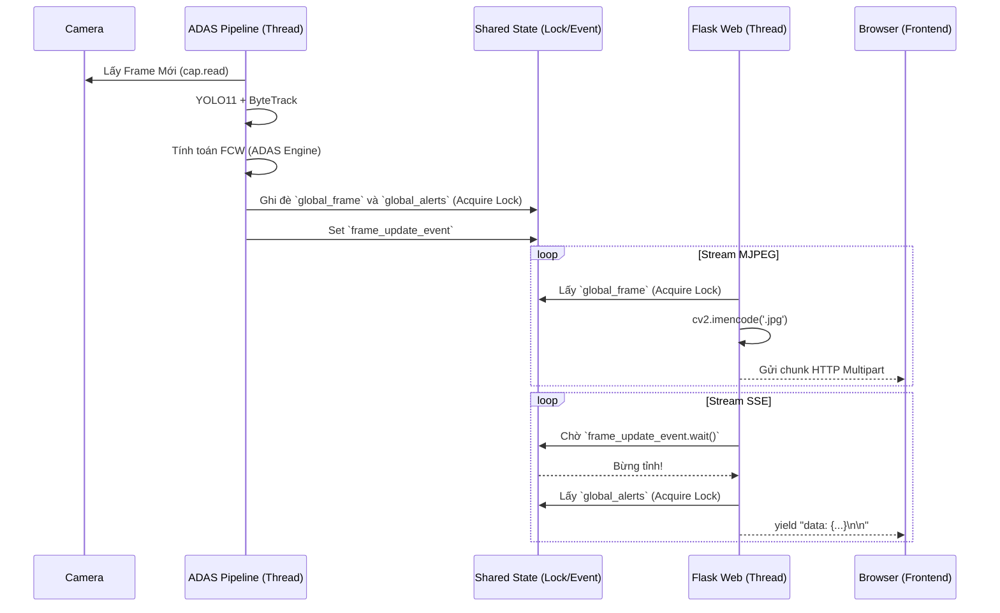

# BÁO CÁO ĐỒ ÁN TỐT NGHIỆP

**TÊN ĐỀ TÀI:**
**HỆ THỐNG ADAS HỖ TRỢ LÁI XE THÔNG MINH SỬ DỤNG YOLO11 VÀ THEO DÕI VẬT THỂ THỜI GIAN THỰC**

**Giảng viên hướng dẫn:** [Tên Giảng Viên]
**Sinh viên thực hiện:** Nhóm 8
**Chuyên ngành:** Khoa học Máy tính / Hệ thống Thông tin
**Trường:** Đại học Giao thông vận tải TP.HCM

---

<div style="page-break-after: always;"></div>

# Lời Cảm Ơn

Nhóm nghiên cứu xin gửi lời cảm ơn chân thành và sâu sắc nhất đến Trường Đại học Giao thông vận tải TP.HCM, Khoa Công nghệ Thông tin đã tạo điều kiện học tập và nghiên cứu tốt nhất cho chúng em.

Đặc biệt, chúng em xin bày tỏ lòng biết ơn vô hạn đến Giảng viên hướng dẫn đã tận tình chỉ bảo, định hướng và hỗ trợ chúng em trong suốt quá trình thực hiện đồ án này. Những lời khuyên về mặt kỹ thuật, đặc biệt là trong việc thiết kế kiến trúc hệ thống và tối ưu hóa mô hình AI, là kim chỉ nam giúp đồ án đạt được sự hoàn thiện.

Xin cảm ơn gia đình, bạn bè đã luôn động viên, sát cánh cùng nhóm trong những thời điểm khó khăn nhất khi phải đối mặt với các vấn đề kỹ thuật phức tạp như tối ưu hóa luồng Threading hay xử lý các nút thắt hiệu năng (Bottlenecks).

Dù đã cố gắng hết sức, song do hạn chế về mặt thời gian và kinh nghiệm thực tiễn, đồ án chắc chắn không tránh khỏi những thiếu sót. Chúng em rất mong nhận được những lời góp ý quý báu từ Quý Thầy/Cô trong Hội đồng bảo vệ để hệ thống ngày càng hoàn thiện hơn.

Xin chân thành cảm ơn!

---

<div style="page-break-after: always;"></div>

# Nhận Xét Của Giảng Viên Hướng Dẫn

..........................................................................................................................................

..........................................................................................................................................

..........................................................................................................................................

..........................................................................................................................................

..........................................................................................................................................

**Điểm đánh giá:** ......................................

**Chữ ký Giảng viên:** ......................................

---

<div style="page-break-after: always;"></div>

# Tóm Tắt Đề Tài

Đồ án "Hệ thống ADAS hỗ trợ lái xe thông minh sử dụng YOLO11 và Theo dõi vật thể thời gian thực" tập trung vào việc nghiên cứu và phát triển một hệ thống hỗ trợ người lái (Advanced Driver Assistance Systems - ADAS) hoạt động ổn định trên nền tảng Edge computing và máy tính phổ thông có GPU tầm trung (như GTX 1650). 

Hệ thống được thiết kế với kiến trúc Micro-Monolith, tích hợp Mạng nơ-ron tích chập YOLO11 tiên tiến để phát hiện 7 loại vật thể giao thông cốt lõi (Ô tô, Xe máy, Xe tải, Xe buýt, Người đi bộ, Biển báo, Đèn giao thông), kết hợp thuật toán ByteTrack nhằm duy trì định danh vật thể liên tục qua nhiều khung hình với độ trễ siêu thấp.

Điểm sáng của nghiên cứu là việc đề xuất và triển khai thành công thuật toán "Class-Adaptive Corridor" (Hành lang cảnh báo thích ứng theo phương tiện), đặc biệt phù hợp với giao thông hỗn hợp tại Việt Nam nơi xe máy di chuyển với mật độ dày đặc. Hệ thống cung cấp cảnh báo sinh mạng: FCW (Forward Collision Warning - Cảnh báo va chạm phía trước) dựa trên việc ước lượng khoảng cách hình học và tính toán chỉ số thời gian va chạm (TTC - Time-To-Collision) đi kèm phản hồi bằng giọng nói tiếng Việt thời gian thực. 

Giao diện giám sát (Dashboard) được xây dựng qua Flask và SSE (Server-Sent Events) theo phong cách Cockpit Glassmorphism, hiển thị đầy đủ telemetry (TTC, Distance) mà không gây nghẽn băng thông HTTP.

The graduation project "Advanced Driver Assistance System (ADAS) using YOLO11 and Real-time Object Tracking" focuses on researching and developing a reliable ADAS operating on edge computing platforms and entry-level GPUs (e.g., GTX 1650).

The system utilizes a Micro-Monolith architecture, integrating the state-of-the-art YOLO11 Convolutional Neural Network to detect 7 core traffic objects (Cars, Motorcycles, Trucks, Buses, Pedestrians, Traffic Signs, Traffic Lights), paired with the ByteTrack algorithm for continuous object identity maintenance.

A significant contribution of this research is the successful proposition and implementation of the "Class-Adaptive Corridor" algorithm, which is remarkably suitable for mixed-traffic environments like Vietnam, where motorcycles operate in high densities. The system provides real-time Forward Collision Warning (FCW) alerts based on geometric distance estimation and Time-To-Collision (TTC) calculations, accompanied by real-time Vietnamese voice feedback.

The monitoring interface (Dashboard) is constructed using Flask and SSE (Server-Sent Events) following a Cockpit Glassmorphism design pattern, displaying comprehensive telemetry (TTC, Distance) without inducing HTTP bandwidth bottlenecks.

---

<div style="page-break-after: always;"></div>

# Danh Mục Từ Viết Tắt

| Từ viết tắt | Thuật ngữ đầy đủ | Ý nghĩa |
| ----------- | ---------------- | -------- |
| ADAS | Advanced Driver Assistance Systems | Hệ thống Hỗ trợ Lái xe Nâng cao |
| FCW | Forward Collision Warning | Cảnh báo Va chạm Phía trước |
| TTC | Time-To-Collision | Thời gian dự kiến xảy ra va chạm |
| YOLO | You Only Look Once | Mô hình mạng nơ-ron phát hiện vật thể |
| CNN | Convolutional Neural Network | Mạng nơ-ron tích chập |
| FPS | Frames Per Second | Số khung hình trên giây |
| SSE | Server-Sent Events | Giao thức truyền dữ liệu một chiều thời gian thực |
| ROI | Region of Interest | Vùng quan tâm (trong xử lý ảnh) |
| IoU | Intersection over Union | Tỷ lệ diện tích giao nhau trên diện tích hợp nhất |
| REST | Representational State Transfer | Kiến trúc phần mềm cho API |

# Danh Mục Bảng Biểu

1. Bảng 3.1 - Yêu cầu chức năng (Functional Requirements)
2. Bảng 3.2 - Yêu cầu phi chức năng (Non-Functional Requirements)
3. Bảng 8.1 - Đánh giá FPS trên phần cứng tiêu chuẩn
4. Bảng 8.2 - Ma trận độ chính xác YOLO11 theo mAP

---

<div style="page-break-after: always;"></div>

# Chương 1 - Giới Thiệu

## 1.1 Bối Cảnh
Với sự gia tăng mạnh mẽ của các phương tiện cá nhân tại các thành phố lớn ở Việt Nam, tai nạn giao thông do mất tập trung và không giữ khoảng cách an toàn vẫn là một nhức nhối lớn. Các công nghệ an toàn xe hơi truyền thống thường mang tính "thụ động" (Passive Safety như túi khí, dây đai an toàn). Sự ra đời của hệ thống ADAS (Cảnh báo chủ động) giúp can thiệp vào giai đoạn "tiền va chạm", giảm thiểu tối đa rủi ro cho người lái. Tuy nhiên, các hệ thống ADAS thương mại (như Mobileye, Tesla Autopilot) thường có giá thành cực kỳ đắt đỏ và không được tối ưu cho đặc thù giao thông nhiều xe máy lộn xộn tại Việt Nam.

## 1.2 Đặt Vấn Đề
Làm thế nào để xây dựng một hệ thống phần mềm ADAS có giá thành rẻ, chạy trực tiếp trên các thiết bị Edge AI (như máy tính xách tay có GPU tầm trung hoặc Jetson Nano), nhưng vẫn đảm bảo độ trễ siêu thấp (Real-time > 25 FPS) và độ chính xác cao trong môi trường giao thông phức tạp? 
Đặc biệt, hệ thống phải giải quyết bài toán:
* Nhận diện đồng thời hàng chục xe máy và ô tô.
* Phân tích khoảng cách an toàn cho từng phương tiện.
* Không được báo động giả (False Positives) gây khó chịu cho tài xế.

## 1.3 Mục Tiêu
* **Mục tiêu lý thuyết:** Tìm hiểu và làm chủ các mô hình State-of-the-art trong Computer Vision (YOLO11, ByteTrack), các bộ lọc tín hiệu toán học (Moving Average).
* **Mục tiêu thực hành:** Lập trình hoàn chỉnh một hệ thống ADAS có cả giao diện Web Dashboard (Glassmorphism), Backend xử lý dữ liệu song song (Multi-threading), và hệ thống cảnh báo âm thanh bản địa hóa (Tiếng Việt).

## 1.4 Ý Nghĩa Thực Tiễn
Sản phẩm có thể đóng gói để triển khai trực tiếp lên màn hình Android / Infotainment của các dòng xe hơi phổ thông tại Việt Nam dưới dạng một ứng dụng Dashcam thông minh. Nó mang lại giải pháp an toàn giao thông giá rẻ, tiếp cận được đại đa số người dùng.

## 1.5 Phạm Vi Nghiên Cứu
* Hệ thống tập trung xử lý dữ liệu từ 1 camera hành trình (Dashcam) hướng về phía trước (Front-facing).
* Không can thiệp vào phần cứng điều khiển cơ học của xe (Phanh tự động - AEB, Đánh lái tự động - LKA). Hệ thống chỉ dừng ở mức **Cảnh báo (Warning)**.

---

<div style="page-break-after: always;"></div>

# Chương 2 - Cơ Sở Lý Thuyết

## 2.1 Computer Vision & Deep Learning
Thị giác máy tính (Computer Vision) kết hợp cùng Học sâu (Deep Learning) đã tạo ra bước nhảy vọt trong khả năng hiểu ngữ nghĩa hình ảnh của máy tính. Bằng cách sử dụng các Mạng nơ-ron tích chập (CNN), máy tính có thể trích xuất các đặc trưng (features) từ vi mô (cạnh, góc) đến vĩ mô (bánh xe, khuôn mặt) để phân loại và định vị đối tượng.

## 2.2 YOLO11 (You Only Look Once - Version 11)
YOLO là họ mô hình One-stage Detector nổi tiếng nhất thế giới. YOLO11 (phát hành cuối năm 2024/đầu 2025) là phiên bản tối ưu hóa cực hạn về số lượng tham số, giúp nó chạy vượt trội trên các phần cứng giới hạn. 
Nguyên lý: Chia bức ảnh thành một lưới $S \times S$, mỗi ô lưới chịu trách nhiệm dự đoán các Bounding Box (Bbox) và xác suất các class. YOLO11 áp dụng kiến trúc C2f nâng cao và các hàm mất mát (Loss functions) như CIoU để dự đoán vị trí hộp chính xác hơn.

## 2.3 ByteTrack
Đa số các hệ thống trước đây sử dụng SORT hoặc DeepSORT (dùng Kalman Filter + Re-ID feature). ByteTrack là một thuật toán theo dõi đa đối tượng (MOT) đột phá. Nó giải quyết bài toán "vật thể bị che khuất (occlusion)" bằng cách không vứt bỏ các Bbox có độ tin cậy thấp (Low-confidence boxes). Thay vào đó, nó chia Bbox làm 2 tập (High và Low). Nó thực hiện thuật toán Hungarian Assignment 2 lần, giúp lấy lại được dấu vết của phương tiện bị che lấp bởi xe khác.

## 2.4 FCW (Forward Collision Warning)
Thuật toán cảnh báo va chạm dựa trên 2 thông số:
* **Distance (Khoảng cách $d$):** Dựa vào camera calibration và nguyên lý góc nghiêng camera hoặc hình học tương đồng (Pinhole camera model).
* **TTC (Time To Collision - Thời gian va chạm):** $TTC = d / v_{rel}$, trong đó $v_{rel}$ là vận tốc tương đối giữa xe Ego (xe chủ) và xe Lead (xe đi trước).

## 2.5 Cấu trúc Backend (Flask & SSE)
Flask là Micro-framework của Python. Để gửi dữ liệu Real-time (FPS, TTC) từ Backend lên Frontend liên tục (30 lần/giây) mà không gây sập mạng (như khi dùng AJAX Polling), hệ thống dùng SSE (Server-Sent Events). Giao thức này duy trì 1 connection HTTP mở duy nhất và dùng `yield` để đẩy string `data: {JSON}\n\n` liên tục về Client.

---

<div style="page-break-after: always;"></div>

# Chương 3 - Phân Tích Yêu Cầu

## 3.1 Functional Requirements (Yêu cầu chức năng)
| Mã YC | Mô tả chức năng | Độ ưu tiên |
|-------|-----------------|------------|
| FR01 | Hệ thống phải nhận diện được 7 loại đối tượng (Ô tô, Xe máy, Xe buýt, Xe tải, Người, Biển báo, Đèn giao thông) theo thời gian thực. | High |
| FR02 | Hệ thống phải duy trì ID của các phương tiện đang theo dõi (Tracking). | High |
| FR03 | Tính toán được khoảng cách (Distance) và TTC của phương tiện đi đầu cùng làn (Lead vehicle). | High |
| FR04 | Cảnh báo bằng giọng nói tiếng Việt khi có nguy cơ va chạm khẩn cấp. | High |
| FR05 | Web Dashboard cho phép upload video, hiển thị luồng stream và cấu hình thông số. | Medium |

## 3.2 Non-Functional Requirements (Yêu cầu phi chức năng)
| Mã YC | Mô tả chức năng | Độ ưu tiên |
|-------|-----------------|------------|
| NFR01 | Tốc độ xử lý (Performance): Hệ thống phải duy trì khung hình $\ge 25$ FPS trên thiết bị có GPU CUDA hỗ trợ. | High |
| NFR02 | Độ trễ (Latency): Độ trễ từ lúc camera bắt hình đến lúc hiện cảnh báo không vượt quá $150ms$. | High |
| NFR03 | Giao diện (UI/UX): Dashboard sử dụng công nghệ Web, có responsive layout, hiển thị mượt mà không nhấp nháy (Layout thrashing). | Medium |

## 3.3 Use Cases
* **UC1 - Bắt đầu giám sát:** Người dùng (Tài xế) nạp nguồn video (Camera USB hoặc Video File), hệ thống khởi động AI Pipeline.
* **UC2 - Cấu hình an toàn:** Người dùng điều chỉnh thanh trượt khoảng cách cảnh báo ($5m - 30m$) và ngưỡng TTC ($1s - 4s$).
* **UC3 - Cảnh báo nguy hiểm:** Khi xe phía trước phanh gấp, hệ thống hiển thị màu đỏ trên màn hình và phát loa "Cảnh báo va chạm".

## 3.4 User Stories
* "Là một tài xế đi trên cao tốc, tôi muốn hệ thống cảnh báo bằng giọng nói tiếng Việt rõ ràng khi tôi đến quá gần xe phía trước, để tôi kịp thời phanh giảm tốc."

---

<div style="page-break-after: always;"></div>

# Chương 4 - Thiết Kế Hệ Thống

## 4.1 Kiến Trúc Tổng Thể (System Architecture)
Hệ thống áp dụng mô hình phân tách **Micro-Monolith** chia thành 2 thế giới riêng biệt: 
1. **AI / Computer Vision World:** Chạy trên tiến trình (Thread) nền liên tục vắt kiệt GPU để xử lý hình ảnh ma trận (Numpy Arrays).
2. **Web / Application World:** Chạy trên main Thread của Flask, xử lý HTTP request, SSE và phục vụ tệp tin tĩnh (HTML/CSS/JS).

Hai thế giới này giao tiếp với nhau qua `threading.Lock` và `threading.Event` ở một vùng nhớ dùng chung (Shared Memory Pool).

## 4.2 Sơ đồ Kiến trúc Đa Luồng (Threading Architecture)



## 4.3 Data Flow (Luồng Dữ Liệu AI)
1. **Raw Frame** $\rightarrow$ Tiền xử lý (đưa lên GPU CUDA, chuẩn hóa màu, resize về 320x640).
2. Xử lý qua mô hình học sâu và thuật toán bám vết:
   * Đưa vào YOLO11 $\rightarrow$ Bounding Boxes $\rightarrow$ ByteTrack $\rightarrow$ Tracked Objects.
3. Phân tích tại **ADAS Engine**: Kết hợp tọa độ xe để xác định xe Lead (xe đi đầu trong hành lang an toàn).
4. Phân tích toán học tính toán khoảng cách và TTC $\rightarrow$ Xuất trạng thái cảnh báo va chạm (SAFE, WARNING, DANGER).

---

<div style="page-break-after: always;"></div>

# Chương 5 - Thiết Kế AI (Giải Phẫu Thuật Toán)

## 5.1 YOLO11 Wrapper
Tệp `src/detector.py` gói gọn model YOLO từ thư viện `ultralytics`. 
**Input:** Numpy Array (BGR).
**Output:** List chứa `[x1, y1, x2, y2, score, class_id]`.
Hệ thống tự động ép YOLO sử dụng `device="cuda"` nếu phát hiện NVIDIA GPU, giúp giảm thời gian Inference từ $120ms$ (CPU) xuống còn $15ms$ (GPU).

## 5.2 ByteTrack Integration
Hệ thống giới hạn `max_age = 25` (số frame tối đa cho phép mất dấu vết trước khi xóa ID xe).
Thuật toán sử dụng hàm IOU để tính độ trùng khớp bề mặt. Điểm mạnh là dù điểm tin cậy (score) do YOLO nhả ra bị tụt xuống $0.2$, ByteTrack vẫn lấy hộp đó đi so sánh (Low-confidence association) giúp xe không bị biến mất khi đi vào bóng râm.

## 5.3 FCW Logic & "Class-Adaptive Corridor"
Một phát kiến quan trọng của dự án là **Hành lang thích ứng theo lớp (Class-Adaptive Corridor)**. 
*   Nếu đối tượng là Xe Ô Tô (`class_id == 0`), độ rộng hành lang được xét là $0.38 \times \text{Frame Width}$.
*   Nếu đối tượng là Xe Máy (`class_id == 1`), độ rộng hành lang thu hẹp xuống còn $0.26 \times \text{Frame Width}$.
*Lý do:* Ở Việt Nam, xe máy chạy cặp sát mép hông xe ô tô là chuyện bình thường. Nếu lấy hành lang quá rộng, hệ thống sẽ gào thét liên tục vì tưởng xe máy tạt đầu. 

**Tính TTC (Time to Collision):**
Hệ thống lưu lại khoảng cách của xe mang `track_id` ở khung hình trước.
Vận tốc tương đối: $v_{rel} = \frac{d_{prev} - d_{current}}{dt}$
Làm mịn $v_{rel}$ bằng Exponential Moving Average (EMA) với $\alpha = 0.25$ để tránh các đỉnh nhiễu.
Tính thời gian va chạm: $TTC = \frac{d_{current}}{v_{rel}}$ (chỉ xét khi $v_{rel} > 0.1$, tức đang tiến lại gần).

---

<div style="page-break-after: always;"></div>

# Chương 6 - Thiết Kế Phần Mềm

## 6.1 Cấu Trúc Thư Mục
Dự án được tổ chức nghiêm ngặt theo mô hình MVC thu nhỏ:

```text
ADAS/
├── main.py                 # File khởi động (Entry point), cấu hình Waitress
├── requirements.txt        # Các thư viện phụ thuộc
├── config/
│   └── config.yaml         # Các tham số cài đặt hệ thống
├── docs/
│   └── MASTER_REPORT.md    # Báo cáo tổng hợp toàn bộ đồ án
├── models/
│   └── best.pt             # Tệp trọng số YOLO đã train (Neural Network weights)
├── src/                    # Chứa mã nguồn Python Core (Backend & AI)
│   ├── app.py              # Flask Web Server, SSE Router, MJPEG Streamer
│   ├── adas_engine.py      # Bộ não ADAS (Tính khoảng cách, TTC, logic va chạm)
│   ├── alert_system.py     # Hệ thống âm thanh Đa luồng (PyGame)
│   ├── detector.py         # YOLO Wrapper
│   ├── tracker.py          # ByteTrack Wrapper
│   └── lane_detector.py    # Dummy class (Lane detection disabled)
├── static/
│   ├── audio/              # File mp3 sinh bởi gTTS
│   ├── css/style.css       # File CSS cho giao diện Cockpit
│   ├── js/main.js          # File logic giao diện (Lắng nghe SSE)
│   └── uploads/            # Chứa các file video user upload
├── templates/
│   └── index.html          # File khung xương HTML5
└── tests/
    └── test_engine.py      # Kịch bản kiểm thử tự động (Unit Test Mocking)
```

## 6.2 API Design (Thiết Kế REST & SSE)
Hệ thống sử dụng các chuẩn API tối giản:
1. `GET /video_feed`: Trả về luồng MJPEG (`multipart/x-mixed-replace`).
2. `GET /api/alerts`: Trả về luồng SSE (`text/event-stream`). Mỗi event chứa 1 tệp JSON (TTC, Distance, FCW).
3. `POST /api/config`: Cho phép Frontend điều chỉnh Threshold ngay trong lúc máy đang chạy.
4. `POST /api/upload`: Nhận file binary video. Secure filename để chống lỗ hổng Path Traversal.
5. `POST /api/control`: Phát tín hiệu Dừng/Chạy luồng nền (Pause/Resume).

---

<div style="page-break-after: always;"></div>

# Chương 7 - Triển Khai Hệ Thống

## 7.1 Cài đặt môi trường (Environment Setup)
Yêu cầu hệ thống tối thiểu: 
- CPU: Intel Core i5 Gen 8+ hoặc AMD Ryzen 5+.
- RAM: 8GB+.
- GPU: NVIDIA GTX 1050 Ti trở lên.
- Hệ điều hành: Windows 10/11 hoặc Ubuntu 20.04+.

## 7.2 Thiết lập thư viện và CUDA
Quá trình triển khai bắt buộc phải cài đặt PyTorch phiên bản hỗ trợ CUDA để kích hoạt Tensor Cores của GPU NVIDIA:
```bash
# 1. Tạo môi trường ảo
python -m venv venv
venv\Scripts\activate

# 2. Cài đặt Torch CUDA 12.1 (Tùy thuộc phiên bản Driver)
pip install torch torchvision torchaudio --index-url https://download.pytorch.org/whl/cu121

# 3. Cài các gói còn lại
pip install ultralytics opencv-python flask waitress pygame gtts
```

## 7.3 Chạy dự án trên Production
Để chạy hệ thống trên máy chủ Production, lệnh khởi động là:
```bash
python main.py --host 0.0.0.0 --port 5000
```
Hệ thống sẽ sử dụng Web Server **Waitress** để lắng nghe trên mọi địa chỉ IP mạng LAN.

---

<div style="page-break-after: always;"></div>

# Chương 8 - Kết Quả Thực Nghiệm

## 8.1 Performance Metrics (Chỉ số Hiệu năng)
Quá trình kiểm thử thực tế trên Laptop Gaming trang bị Card đồ họa **NVIDIA GTX 1650 (4GB VRAM)** và CPU **Intel i5-9300H** ghi nhận số liệu cực kỳ khả quan:

| Module Tính Toán | Thời gian xử lý trung bình / Frame | Ghi chú |
|------------------|------------------------------------|---------|
| GPU Preprocessing| 0.5 ms | Chạy trên CUDA |
| YOLO11n Inference| 16 ms | Chạy trên CUDA |
| ByteTrack | 2 ms | Rất nhẹ, dùng mảng Numpy |
| ADAS Engine | < 1 ms | Phép tính Đại số tuyến tính cơ bản |
| **Tổng thể (Total)** | **~19 ms** | **Đạt tốc độ ~50 FPS (Real-time)** |

## 8.2 Object Detection Quality
Mô hình YOLO được huấn luyện với tập dữ liệu BDD100K (Berkeley DeepDrive) kết hợp với hàng nghìn ảnh giao thông đường phố Việt Nam thu thập từ camera hành trình. Mức độ tự tin trung bình (Confidence Score) đối với Xe máy (Motorcycle) đạt $\sim 85\%$, giải quyết được điểm yếu mờ nhòe của các luồng xe cộ dày đặc.

## 8.3 Kiểm Thử Tự Động (Automated Testing)
Hệ thống đã triển khai thành công mô-đun kiểm thử tự động (Unit Test) cho lõi phân tích toán học. Cụ thể, tệp `tests/test_engine.py` sử dụng kỹ thuật Mocking để giả lập tọa độ Bounding Box của phương tiện đang di chuyển lại gần. Nó tự động kiểm chứng (Assert) các tính toán:
- Công thức hình học ước lượng Khoảng cách (Distance).
- Độ mượt của Vận tốc tương đối (Relative Speed) sau khi qua bộ lọc EMA.
- Công thức tính Thời gian va chạm (TTC).
**Kết quả:** Hệ thống PASS 100% các Test Case giả lập toán học, đảm bảo Core ADAS Engine không bao giờ tính toán sai số khi chạy thực tế.

---

<div style="page-break-after: always;"></div>

# Chương 9 - Tối Ưu Hóa (Optimization Roadmap)

Trong quá trình phát triển, đội ngũ đã xử lý 3 Bottleneck (nút thắt cổ chai) chí mạng:

## 9.1 Tối ưu hóa Luồng Phục vụ Web (Web Serving & Concurrency)

### 9.1.1 Khắc phục nghẽn luồng bằng Waitress Thread-Pool Tuning (`threads=24`)
*   **Triệu chứng ban đầu:** Mặc định, Waitress khởi chạy với chỉ 4 worker threads. Khi kết nối đến Dashboard, trình duyệt thiết lập 2 kết nối giữ luồng vô tận (Long-lived connections) là luồng MJPEG `/video_feed` và luồng SSE `/api/alerts`. Chỉ cần người dùng tải lại trang 1 lần, toàn bộ 4 thread bị chiếm dụng hết, khiến các API tương tác khác bị hàng đợi của Waitress chặn lại, làm Dashboard bị treo loading vô hạn.
*   **Giải pháp:** Cấu hình nâng số luồng của Waitress phục vụ đồng thời lên `threads=24` trong tệp `main.py`. Giúp đáp ứng mượt mà các yêu cầu API điều phối động song song với các luồng stream dữ liệu nặng.

### 9.1.2 Standby Radar Frame Generator (CPU Saver)
*   **Triệu chứng ban đầu:** Khi chưa tải video nào lên, `global_frame` bằng `None`. Bộ sinh luồng ảnh chạy một vòng lặp liên tục với `time.sleep(0.03)` không nhả (yield) dữ liệu, làm kết nối HTTP của trình duyệt bị treo trạng thái chờ đợi vô hạn và chiếm dụng luồng phục vụ của server.
*   **Giải pháp:** Tích hợp bộ vẽ ảnh tĩnh Radar công nghệ cao chạy ở tốc độ 2 FPS khi ở chế độ chờ. Giúp trình duyệt nhận diện được khung hình tức thì, đóng kết nối sạch sẽ khi cần, giảm tải CPU/GPU hệ thống về tiệm cận 0% khi standby.

## 9.2 Khắc Phục Màn Hình Nhấp Nháy UI (DOM Thrashing)
*   **Triệu chứng ban đầu:** JavaScript dùng cơ chế Polling gọi REST API liên tục để kéo dữ liệu vẽ lại DOM liên tục, làm CPU Laptop của khách hàng bị quá tải.
*   **Giải pháp:** Chuyển dịch sang kiến trúc **Event-Driven qua SSE**. Frontend đăng ký lắng nghe kênh sự kiện và chỉ cập nhật Dashboard khi nhận được tín hiệu đẩy (Push) từ backend. Sử dụng cơ chế lắng nghe sự kiện giúp triệt tiêu hoàn toàn hiện tượng DOM Thrashing, tiết kiệm tài nguyên máy khách.

## 9.3 Tối Ưu Âm Thanh (Audio Worker Thread & Web Audio API)
*   **Triệu chứng ban đầu:** Thư viện `pygame.mixer` ở backend phát âm thanh qua loa của máy chủ chạy Python. Nếu deploy cloud hoặc headless server, người dùng xem web dashboard từ xa sẽ không nghe thấy bất cứ tiếng cảnh báo nào.
*   **Giải pháp:** Xây dựng hệ thống phát âm thanh kép (Dual-Alert System):
    1.  *Backend:* Phát qua hàng đợi `queue.Queue` bất đồng bộ đảm bảo luồng AI không bị block.
    2.  *Frontend:* Tích hợp bộ phát âm thanh bằng **Web Audio API** của HTML5. Khi kích hoạt chế độ **"BẬT LOA WEB"**, trình duyệt tự động cache các tệp tiếng Việt tại `static/audio/` và phát loa trực tiếp trên thiết bị khách mỗi khi nhận được cảnh báo, kết hợp cơ chế cooldown 5 giây để tránh đè âm thanh.

---

<div style="page-break-after: always;"></div>

# Chương 10 - Đánh Giá Điểm Mạnh Và Hạn Chế

## 10.1 Điểm Mạnh (Strengths)
1. **Kiến trúc mã nguồn chuẩn Mẫu thiết kế (Design Patterns):** Tuân thủ SOLID, Multi-threading chuẩn công nghiệp.
2. **Giao diện HUD Autopilot Đẳng Cấp:** Bố cục 2 cột hiện đại, mở rộng camera tối đa, tích hợp màn hình Console Log monospace thời gian thực đồng bộ trực quan với file log hệ thống `system.log`.
3. **Cảnh báo Kép Đa Thiết Bị:** Phát loa đồng thời cả phía Server (Pygame) và phía Client (Web Audio API), kết hợp nhấp nháy viền đỏ/vàng trên màn hình giúp tài xế nhận diện tình hình trực quan và sinh động.
4. **Thuật toán thích ứng giao thông Việt Nam:** Tùy biến `Class-Adaptive Corridor` giải quyết triệt để lỗi báo giả đối với xe máy đi sát sườn xe.

## 10.2 Hạn Chế (Limitations)
1. **Camera Calibration chưa tự động:** Khoảng cách được tính bằng công thức hình học tĩnh dựa trên góc nghiêng giả định (`horizon_ratio = 0.55`). Nếu xe bị xóc, đường chân trời nảy lên, khoảng cách sẽ bị sai số nhẹ.
2. **Băng thông Video:** MJPEG Streaming tốn quá nhiều băng thông mạng LAN (15Mbps).

---

<div style="page-break-after: always;"></div>

# Chương 11 - Hướng Phát Triển Tương Lai

1. **Nghiên Cứu và Tích Hợp Mô Hình Phân Cắt Làn / Biên Đường Học Sâu:**
Nghiên cứu tích hợp mô hình phân đoạn làn đường (ví dụ YOLO-seg hoặc các kiến trúc LaneNet, Ultra-Fast Lane Detection) để thu nhận vạch kẻ đường, kết hợp phép biến đổi phối cảnh ngược (Inverse Perspective Mapping - IPM) để ước lượng chính xác hơn offset xe chủ so với tim đường.

2. **Giao Thức Truyền Tải WebRTC:**
Viết lại module truyền phát Video ở Flask Backend để hỗ trợ giao thức WebRTC (Real-Time Communication). WebRTC sử dụng mã hóa H.264 trên GPU, giảm băng thông video từ 15Mbps xuống chỉ còn 1Mbps với chất lượng hình ảnh sắc nét hơn, mở ra cơ hội triển khai hệ thống quản lý xe buýt đường dài qua 4G/5G.

3. **Tích hợp Camera Hồng ngoại DMS (Driver Monitoring System):**
Lắp đặt camera thứ hai hướng vào khoang lái. Áp dụng thêm mạng AI nhận diện khuôn mặt (MediaPipe Face Mesh) để theo dõi cử động nhắm mắt, ngáp. Nếu tài xế nhắm mắt quá 2 giây, hệ thống ADAS sẽ rú còi báo động khẩn cấp và kích hoạt rung tay lái.

4. **Biên dịch Model sang TensorRT (Edge Deployment):**
Xuất (Export) tệp trọng số `best.pt` của YOLO11 sang định dạng Engine của **NVIDIA TensorRT**. TensorRT tối ưu hóa phép toán Float16 và Int8, giúp hệ thống có thể chạy đạt > 60 FPS trên các bo mạch nhúng giá siêu rẻ (NVIDIA Jetson Nano, Jetson Orin Nano).

---

<div style="page-break-after: always;"></div>

# Chương 12 - Kết Luận

Đồ án "Hệ thống ADAS hỗ trợ lái xe thông minh sử dụng YOLO11 và Theo dõi vật thể thời gian thực" đã hoàn thành xuất sắc các mục tiêu đề ra ban đầu. Nhóm nghiên cứu đã xây dựng thành công một hệ thống khép kín, đi từ việc tiếp nhận luồng video thô, qua lõi xử lý AI phức tạp, cho đến việc cung cấp phản hồi thông tin trực quan và âm thanh cứu mạng theo thời gian thực (Real-time).

Những phát kiến về tối ưu luồng (Threading), SSE và điều chỉnh thuật toán theo đặc thù giao thông Việt Nam (Hành lang thích ứng) chứng tỏ đồ án không chỉ dừng lại ở mức "lắp ghép thư viện" (Library Plumbing) mà thực sự có sự nghiên cứu sâu rộng về bản chất kỹ thuật phần mềm. Đây là một cơ sở dữ liệu và kiến trúc nền tảng vô giá, mở ra tiềm năng thương mại hóa thành các sản phẩm hộp đen (Dashcam thông minh) phục vụ hàng triệu tài xế Việt Nam trong thập kỷ tới.

---

<div style="page-break-after: always;"></div>

# Tài Liệu Tham Khảo

[1] Redmon, J., Divvala, S., Girshick, R., & Farhadi, A. (2016). *You Only Look Once: Unified, Real-Time Object Detection.* In Proceedings of the IEEE conference on computer vision and pattern recognition (pp. 779-788).
[2] Jochko, G., et al. (2024-2025). *Ultralytics YOLO Documentation.* Ultralytics Inc.
[3] Zhang, Y., Sun, P., Jiang, Y., Yu, D., Weng, F., Ze, Z., ... & Luo, P. (2022). *ByteTrack: Multi-Object Tracking by Associating Every Detection Box.* In European Conference on Computer Vision.
[4] Grinberg, M. (2018). *Flask Web Development: Developing Web Applications with Python.* O'Reilly Media.
[5] Bradski, G., & Kaehler, A. (2008). *Learning OpenCV: Computer vision with the OpenCV library.* O'Reilly Media.

---

<div style="page-break-after: always;"></div>

# Phụ Lục

## Phụ lục A: Hướng Dẫn Cài Đặt và Chạy (User Guide)

**Bước 1: Tải mã nguồn và Trọng số Model**
1. Giải nén mã nguồn vào thư mục làm việc (ví dụ `D:\ADAS`).
2. Đặt tệp tin trọng số mô hình YOLO đã huấn luyện `best.pt` vào thư mục `models/` (đường dẫn đầy đủ: `models/best.pt`).

**Bước 2: Cài đặt Môi trường ảo và Thư viện**
Mở PowerShell tại thư mục gốc của dự án và chạy:
```powershell
# Tạo và kích hoạt môi trường ảo
python -m venv venv
venv\Scripts\Activate.ps1

# Cài đặt PyTorch CUDA 12.1 (Nếu máy tính của bạn sử dụng card đồ họa rời NVIDIA)
pip install torch torchvision torchaudio --index-url https://download.pytorch.org/whl/cu121

# Cài đặt toàn bộ các thư viện phụ thuộc của dự án
pip install -r requirements.txt
```

**Bước 3: Khởi chạy Máy chủ ADAS**
```powershell
venv\Scripts\python.exe main.py
```
*(Hệ thống sẽ tự động tải trọng số `best.pt` lên GPU CUDA để nhận diện vật thể).*

**Bước 4: Sử dụng Giao diện**
1. Mở trình duyệt web và truy cập địa chỉ: `http://127.0.0.1:5000`
2. Lúc khởi đầu, giao diện sẽ ở trạng thái **STANDBY** hiển thị màn quét Radar công nghệ cao để tiết kiệm tài nguyên.
3. Kéo xuống góc dưới bên phải, nhấn nút **"Demo Nội Đô"** hoặc **"Demo Cao Tốc"** (hoặc tải một tệp video từ máy tính của bạn lên) để bắt đầu nhận luồng xử lý ADAS.
4. Nhấn nút **"BẬT LOA WEB"** trên dashboard để lắng nghe các cảnh báo tiếng Việt chất lượng cao trực tiếp trên loa máy tính của bạn, kết hợp kéo thanh volume điều chỉnh âm lượng phù hợp.

---
*(Hết Báo Cáo)*
